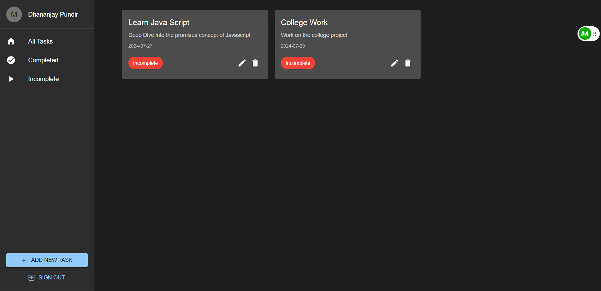

# Task Manager App

This is a task manager application built using React and Material-UI. The app allows users to add, edit, and delete tasks, as well as mark them as completed or incomplete. The tasks are stored in the browser's local storage to persist across page reloads.

## Features

- Add new tasks with title, description, and due date
- Edit existing tasks
- Mark tasks as completed or incomplete
- Delete tasks
- Filter tasks by status: all, completed, or incomplete
- Responsive design using Material-UI
- Dark theme using Material-UI's theming capabilities
- Persistent storage using local storage

## Screenshots

### Screenshot 1

### Screenshot 2

### Screenshot 3

### Screenshot 4

